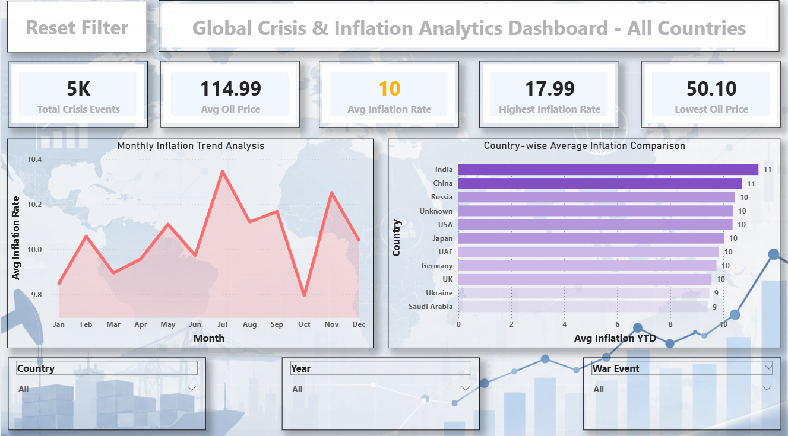

# Global Crisis & Inflation Analytics Dashboard

## Project Overview
This project is an end-to-end SQL and Power BI analytics solution designed to analyze how global war events impact oil prices, inflation rates, shipping disruptions, and economic trends.

The project follows a real-world data analyst workflow:
- Raw data import
- Data cleaning
- Data modeling
- DAX calculations
- KPI reporting
- Interactive Power BI dashboard creation

---

## Tools Used
- Power BI
- DAX
- GitHub

---

## Dataset Overview
The dataset contains 5,000+ records related to:
- War events
- Oil prices
- Inflation rates
- Shipping disruptions
- Currency exchange rates
- Government subsidies
- Unemployment rates

---

## Power BI Dashboard Features

### KPI Cards
- Total Crisis Events
- Average Oil Price
- Average Inflation Rate
- Highest Inflation Rate
- Lowest Oil Price

### Interactive Visuals
- Monthly Inflation Trend Analysis
- Country-wise Average Inflation Comparison
- Dynamic Filters and Slicers

### Advanced Power BI Features
- Dynamic Dashboard Title
- Time Intelligence DAX
- YTD Analysis
- Rolling Averages
- Ranking Measures
- Conditional Formatting

---

## DAX Concepts Practiced
- CALCULATE()
- FILTER()
- DIVIDE()
- TOTALYTD()
- DATEADD()
- RANKX()
- ALL()
- ALLEXCEPT()
- REMOVEFILTERS()
- SELECTEDVALUE()

---

## Key Business Insights
- Border conflicts caused major oil price increases.
- Inflation remained consistently high across multiple countries.
- Shipping delays and cancellations significantly increased during crisis periods.
- Russia and India showed higher average inflation trends compared to several countries.

---

## Dashboard Preview

---

## Files Included

| File | Description |
|---|---|
| global_crisis_inflation_dashboard.pbix | Power BI dashboard |
| global_crisis_inflation_dashboard.pdf | Exported dashboard report |
| global_crisis_dashboard_overview.png | Dashboard screenshot |
| war_oil_inflation_.csv | Raw dataset |

---

## Skills Demonstrated
- Business Analytics
- Data Modeling
- DAX Calculations
- Power BI Dashboard Development
- Time Intelligence Analysis
- KPI Reporting
- Business Storytelling

---

## Author
Navin
